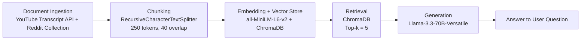

# Project 1 Planning: The Unofficial Guide

> Write this document before you write any pipeline code.
> Your spec and architecture diagram are what you'll use to direct AI tools (Claude, Copilot, etc.) to generate your implementation — the more specific they are, the more useful the generated code will be.
> Update the Retrieval Approach and Chunking Strategy sections if you change your approach during implementation.
> Update this file before starting any stretch features.

---

## Domain

<!-- What domain did you choose? Why is this knowledge valuable and hard to find through official channels? -->
I chose the domain of student experiences with on-campus housing at my university, the University of Texas at Dallas. This knowledge is valuable because it is crucial to help student decide whether to choose to live on or off campus, and what they can expect to experience if they live on campus. This can't really be found through official channels because the university only publishes basic information about what's included with on-campus housing, but not any student reviews or any of the downsides that may come from living on campus. 
---

## Documents

<!-- List your specific sources: URLs, subreddit names, forum threads, or file descriptions.
     Aim for at least 10 sources that together cover different subtopics or perspectives within your domain. -->

| # | Source | Description | URL or location |
|---|--------|-------------|-----------------|
| 1 | YouTube | Video titled "Best Student Housing University Of Texas At Dallas" | https://www.youtube.com/watch?v=ZoanKQ0wrCA |
| 2 | YouTube | Video titled "University Village Apartments - Richardson, TX | UT Dallas On Campus Student Housing" | https://www.youtube.com/watch?v=fRG2uwTNZ8U |
| 3 | YouTube | Video titled "Canyon Creek Heights Apartments - Richardson, TX | UT Dallas On Campus Student Housing" | https://www.youtube.com/watch?v=GvXyADz0sYY |
| 4 | Reddit | Thread titled "How is housing this bad???" | https://www.reddit.com/r/utdallas/comments/1b1q20n/how_is_housing_this_bad/ |
| 5 | Reddit | Thread titled "UTD housing (incoming freshmen)"| https://www.reddit.com/r/utdallas/comments/1tq5ghl/utd_housing_incoming_freshmen/ |
| 6 | Reddit | Thread titled "Need advice on dorms" | https://www.reddit.com/r/utdallas/comments/1j63bv1/need_advice_on_dorms/ |
| 7 | Reddit | Thread titled "What are dorms/housing like on campus? What do I need to bring?" | https://www.reddit.com/r/utdallas/comments/lc26tv/what_are_dormshousing_like_on_campus_what_do_i/ |
| 8 | Reddit | Thread titled "Which dorm/housing should I choose?" | https://www.reddit.com/r/utdallas/comments/sz7f3z/which_dormhousing_should_i_choose/ |
| 9 | Reddit | Thread titled "Best housing option for sophomore year?" | https://www.reddit.com/r/utdallas/comments/d894jm/best_housing_option_for_sophomore_year/ |
| 10 | Reddit | Thread titled "Housing Questions" | https://www.reddit.com/r/utdallas/comments/5v79qe/housing_questions/ |

---

## Chunking Strategy

<!-- How will you split documents into chunks?
     State your chunk size (in tokens or characters), overlap size, and explain why those
     numbers fit the structure of your documents.
     A review-heavy corpus warrants different chunking than a long FAQ. -->

**Chunk size:** 350 tokens 

**Overlap:** 50 tokens

**Reasoning:** I chose 350 tokens for the chunk size because Reddit comments are commonly only 100 or 200 tokens and are very compact, but YouTube transcripts are very long and sparse, so larger chunks are better for those. A reasonable midpoint of 350 tokens per chunk should work well. For the overlap, I chose 40 tokens since an overlap that is too big would result in lots of repeated information between the different chunks, especially with the Reddit comments.

---

## Retrieval Approach

<!-- Which embedding model are you using (e.g., all-MiniLM-L6-v2 via sentence-transformers)?
     How many chunks will you retrieve per query (top-k)?
     If you were deploying this for real users and cost wasn't a constraint, what tradeoffs
     would you weigh in choosing a different embedding model — context length, multilingual
     support, accuracy on domain-specific text, latency? -->

**Embedding model:** all-MiniLM-L6-v2

**Top-k:** 5

**Production tradeoff reflection:** If I was deploying this for real users without any cost constraints, I would go for a significantly larger model that may be much slower, but also much more accurate. Since cost corresponds to the amount of processing power used and cost is not a constraint, the amount of processing power would not be a constraint, and thus, the embedding model would not be too slow to run for the users. Therefore, having a model such as OpenAI's text-embedding-3-large would offer a good tradeoff since it has a large context length, good multilingual support, and high accuracy on domain-specific text, all without having too much latency.

---

## Evaluation Plan

<!-- List your 5 test questions with their expected correct answers.
     Questions should be specific enough that you can judge whether the system's response
     is right or wrong. "What are good dining halls?" is too vague.
     "What do students say about wait times at [dining hall name] during lunch?" is testable. -->

| # | Question | Expected answer |
|---|----------|-----------------|
| 1 | Are Canyon Creek Heights apartments furnished? | "Yes, Canyon Creek Heights apartments are fully furnished. Residents only need to bring their clothes, as all furniture is provided. In addition, all utilities including electricity, Wi-Fi, water, and laundry are included in the rent." |
| 2 | Are the UTD dorms single occupancy or shared rooms? | "UTD freshman dorms feature individual private bedrooms with shared bathroom facilities and common living areas. Each suite consists of three private bedrooms, with residents sharing one toilet, one shower, and multiple individual sinks." |
| 3 | Do the Canyon Creek Heights apartments include utilities in rent? | "Yes, Canyon Creek Heights apartments include comprehensive utilities coverage in the rent, including electricity, water, Wi-Fi, internet access, and laundry facilities. Residents do not incur additional utility costs beyond the base rent." |
| 4 | Is Canyon Creek Heights safe? | "Canyon Creek Heights maintains robust security measures including Comet Card (student ID) access control and regular campus police patrols conducted approximately every thirty minutes throughout the residential area." |
| 5 | Are there any problems with maintenance or insects? | "Based on available sources, specific maintenance or pest-related issues are not extensively documented. While some references indicate that older apartments in University Village may experience general facility concerns, primary student complaints focus on structural issues such as thin walls and inadequate insulation rather than documented maintenance failures or pest infestations." |

---

## Anticipated Challenges

<!-- What could go wrong? Name at least two specific risks with reasoning.
     Consider: noisy or inconsistent documents, missing source attribution, off-topic
     retrieval, chunks that split key information across boundaries. -->

1. One thing that could go wrong is that the different names for the same topic (like University Village being shortened to UV) might hinder the embedding model from providing relevant answers if the topic is mentioned in the original sources with different names.

2. Another thing that could go wrong is that since some of the sources are from Reddit, there may be some sarcastic that the embedding modeld doesn't recognize as sarcasm, which can result in the LLM outputting incorrect answers.

---

## Architecture

<!-- Draw a diagram of your pipeline showing the five stages:
     Document Ingestion → Chunking → Embedding + Vector Store → Retrieval → Generation
     Label each stage with the tool or library you're using.
     You can use ASCII art, a Mermaid diagram, or embed a sketch as an image.
     You'll use this diagram as context when prompting AI tools to implement each stage. -->

---

## AI Tool Plan

<!-- For each part of the pipeline below, describe:
     - Which AI tool you plan to use (Claude, Copilot, ChatGPT, etc.)
     - What you'll give it as input (which sections of this planning.md, which requirements)
     - What you expect it to produce
     - How you'll verify the output matches your spec

     "I'll use AI to help me code" is not a plan.
     "I'll give Claude my Chunking Strategy section and ask it to implement chunk_text()
     with my specified chunk size and overlap" is a plan. -->

**Milestone 3 — Ingestion and chunking:**
I'll use Claude Code to help me scrape my sources and extract all of the relevant raw text on those source websites so I can put them in my documents folder. I will then show it my chunking strategy section and have it implement it in the chunk_text method that I will create with teh specified chunk size and overlap size. I will also give Claude my pipeline diagram alongside that chunking strategy text to help it along even more. Furthermore, I will print 5 random chunks to make sure they're readable and self-contained before moving on.

**Milestone 4 — Embedding and retrieval:**
I'll use Claude Code to help me call the embedding model (all-MiniLM-L6-v2) from sentence-transformers, and apply it to the documents that I've put in my documents folder as sources. Then, I'll have Claude also store that result using ChromaDB, ensuring that they are stored with the appropriate source metadata. Afterwards, I'll also have Claude make a stub given a placeholder text input that runs the embedding model on it and having ChromaDB find the Top-k number of most relevant results, and returning those to the LLM. For verification, I'll test 3 of my 5 evaluation questions to check that returned checks are relevant and have scores of below 0.5. 

**Milestone 5 — Generation and interface:**
I'll give Claude Code my specifications for what LLM I am using and what the basic user interface will need to do in terms of first feeding the user input to the embedding model/retrieval functionality. Then, I'll have Claude Code also generate the LLM handle and the rest of the front end to successfully hand off the user inputs to the back end, as well as the functionality of the LLM to output the text that it has generated. Lastly, I'll ensure that I include a grounding instruction in the system prompt to only answer from the RAG context, and then I'll include the source attribution as text that is programatically generated rather than generated by the LLM. To test this, I'll use an out-of-scope nonsense question to make sure the system refuses to answer.